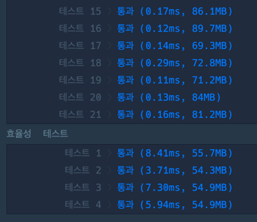

```java
import java.util.*;

class Solution {

    private int[][] Maps;
    private int[][] visited;
    private int[] dy = {-1,0,1,0};
    private int[] dx = {0,1,0,-1};
    private int n;
    private int m;
    
    public int solution(int[][] maps) {
        Maps = maps;
        n = maps.length;
        m = maps[0].length;
        visited = new int[n][m];
        
        for(int i = 0; i < n; i++) {
            Arrays.fill(visited[i], Integer.MAX_VALUE);
        }
        
        bfs();
        
        return visited[n-1][m-1] == Integer.MAX_VALUE ? -1 : visited[n-1][m-1];
    }
    
    public void bfs() {
        int startY = 0;
        int startX = 0;
        visited[startY][startX] = 1;
        
        Queue<int[]> queue = new LinkedList<>();
        queue.add(new int[]{0,0});
        
        while(!queue.isEmpty()) {
            int[] curPosition = queue.poll();
            int curY = curPosition[0];
            int curX = curPosition[1];
            
            for(int i = 0; i < 4; i++) {
                int ny = curY + dy[i];
                int nx = curX + dx[i];
                
                if(ny < 0 || ny >= n || nx < 0 || nx >= m || Maps[ny][nx] == 0 || visited[ny][nx] != Integer.MAX_VALUE) continue;
                
                visited[ny][nx] = Math.min(visited[ny][nx], visited[curY][curX] + 1);
                
                queue.add(new int[]{ny, nx});   
            }
        }
    }
}
```

