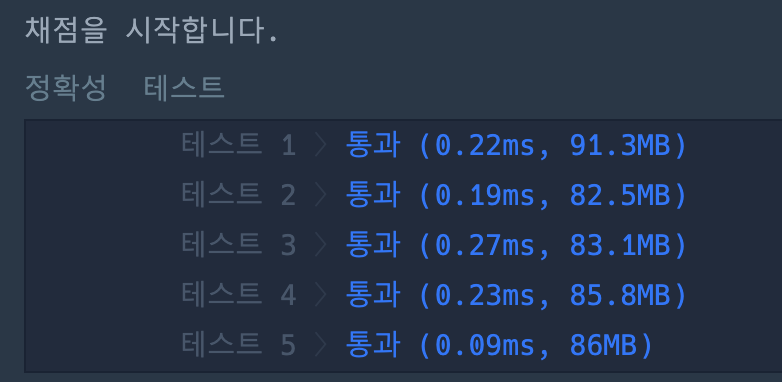

```java
import java.util.*;

class Solution {
    static String Target;
    static String Begin;
    static String[] Words;
    public int solution(String begin, String target, String[] words) {
        int answer = 0;
        Target = target;
        Begin = begin;
        Words = new String[words.length + 1];

        for (int i = 0; i < words.length; i++) {
            Words[i] = words[i];
        }
        Words[words.length] = begin;

        HashSet<String> set = new HashSet<>(Arrays.asList(words));

        if (!set.contains(target)) return 0;

        return bfs();
    }

    static int bfs() {
        boolean[] visited = new boolean[Words.length];
        Queue<int[]> queue = new LinkedList<>();
        int count = 0;
        String cur;
        visited[Words.length - 1] = true;
        queue.add(new int[]{Words.length - 1, 0});

        // 처음에는 words pos 넣고 두번째는 count 넣기
        while(!queue.isEmpty()) {
            cur = Words[queue.peek()[0]];
            count = queue.peek()[1];
            queue.poll();
            if (cur.equals(Target)) return count;

            for (int i = 0; i < Words.length - 1; i++) {
                if (!visited[i] && canExchange(cur, Words[i])) {
                    queue.add(new int[]{i, count + 1});
                    visited[i] = true;
                }
            }
        }

        return 0;
    }

    // 한자리만 달라야 바꿀 수 있음
    static boolean canExchange(String str1, String str2) {
        int count = 0;
        for (int i = 0; i < str1.length(); i++) {
            if (str1.charAt(i) != str2.charAt(i)) count++;
            if (count >= 2) return false;
        }

        return count == 1;
    }
}
```

### 실행결과

