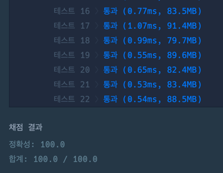

```java
import java.util.*;

class Solution {
    
    private int[] dy = new int[]{-1,0,1,0};
    private int[] dx = new int[]{0,1,0,-1};
    
    private List<List<int[]>> blanks = new ArrayList<>();
    private int[][] GameBoard;
    private boolean[][] gameBoardVisited;
    
    private int[][] Table;
    private List<List<int[]>> puzzles = new ArrayList<>();
    private boolean[][] tableVisited;
    
    private int answer;
    
    public int solution(int[][] game_board, int[][] table) {
        GameBoard = game_board;
        Table = table;
        
        findBlank();
        findPuzzle();
        checkBlankAndPuzzle();
        
        return answer;
    }
    
    private void checkBlankAndPuzzle() {
        answer = 0;
        boolean[] usedPuzzle = new boolean[puzzles.size()];
        
        for (List<int[]> blank : blanks) {
            for (int i = 0; i < puzzles.size(); i++) {
                if (usedPuzzle[i]) continue;
                
                if (check(blank, puzzles.get(i))) {
                    answer += blank.size();
                    usedPuzzle[i] = true;
                    break;
                }
            }
        }
    }
    
    private boolean check(List<int[]> blank, List<int[]> puzzle) {
        List<int[]> normBlank = fixPosition(blank);
        List<int[]> normPuzzle = fixPosition(puzzle);
        
        for (int i = 0; i < 4; i++) {
            if (isSameBlankAndPuzzle(normBlank, normPuzzle)) return true;
            normPuzzle = rotatePuzzle(normPuzzle);
        }
        
        return false;
    }
    
    private List<int[]> rotatePuzzle(List<int[]> puzzle) {
        List<int[]> rotatedPuzzle = new ArrayList<>();
        
        for (int[] point : puzzle) {
            rotatedPuzzle.add(new int[]{point[1], -point[0]});
        }
        
        return fixPosition(rotatedPuzzle);
    }
    
    private List<int[]> fixPosition(List<int[]> positions) {
        int minY = Integer.MAX_VALUE;
        int minX = Integer.MAX_VALUE;
        
        for (int[] position : positions) {
            minY = Math.min(minY, position[0]);
            minX = Math.min(minX, position[1]);
        }
        
        List<int[]> fixedPosition = new ArrayList<>();
        for (int[] position : positions) {
            fixedPosition.add(new int[]{position[0] - minY, position[1] - minX});
        }
        
        fixedPosition.sort((a, b) -> a[0] == b[0] ? a[1] - b[1] : a[0] - b[0]);
        
        return fixedPosition;
    }
    
    private boolean isSameBlankAndPuzzle(List<int[]> blank, List<int[]> puzzle) {
        if (blank.size() != puzzle.size()) return false;
        
        for (int i = 0; i < blank.size(); i++) {
            if (!Arrays.equals(blank.get(i), puzzle.get(i))) return false;
        }
        
        return true;
    }

    private void findPuzzle() {
        tableVisited = new boolean[Table.length][Table[0].length];
        
        for (int i = 0; i < Table.length; i++) {
            for (int j = 0; j < Table[0].length; j++) {
                if (!tableVisited[i][j] && Table[i][j] == 1) {
                    List<int[]> puzzle = new ArrayList<>();
                    dfs(i, j, puzzle, Table, tableVisited, 1);
                    puzzles.add(fixPosition(puzzle));
                }
            }
        }
    }
    
    private void findBlank() {
        gameBoardVisited = new boolean[GameBoard.length][GameBoard[0].length];
        
        for (int i = 0; i < GameBoard.length; i++) {
            for (int j = 0; j < GameBoard[0].length; j++) {
                if (!gameBoardVisited[i][j] && GameBoard[i][j] == 0) {
                    List<int[]> blank = new ArrayList<>();
                    dfs(i, j, blank, GameBoard, gameBoardVisited, 0);
                    blanks.add(fixPosition(blank));
                }
            }
        }
    }
    
   private void dfs(int y, int x, List<int[]> shape, int[][] board, boolean[][] visited, int target) {
        visited[y][x] = true;
        shape.add(new int[]{y, x});

        for (int d = 0; d < 4; d++) {
            int ny = y + dy[d];
            int nx = x + dx[d];

            if (ny >= 0 && ny < board.length && nx >= 0 && nx < board[0].length 
                && !visited[ny][nx] && board[ny][nx] == target) {
                dfs(ny, nx, shape, board, visited, target);
            }
        }
    }
}
```

